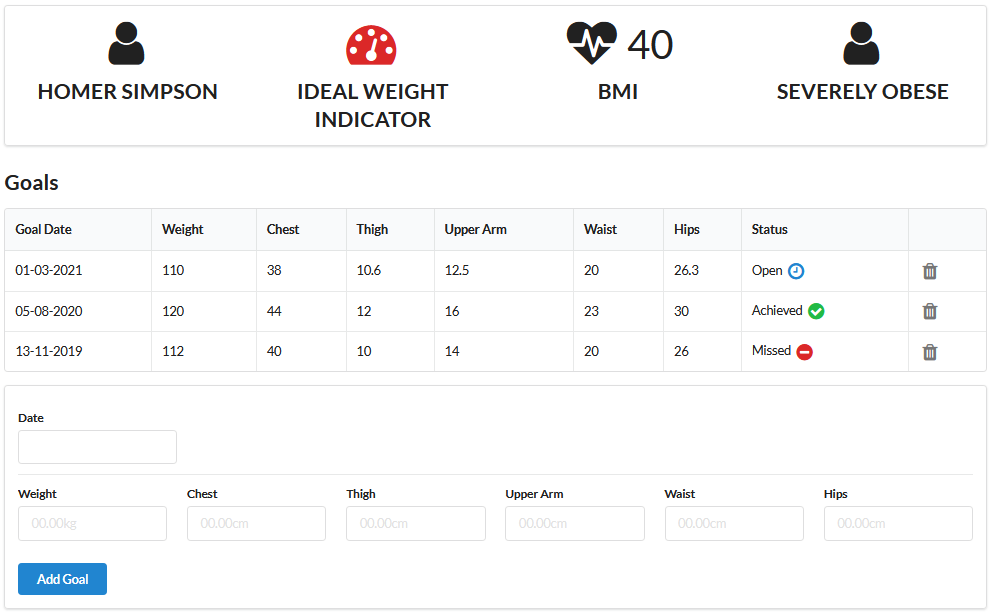

# Fitness Tracker App - JavaScript

This web application is designed for users to record and monitor their fitness activity. The app features user accounts and can be accessed as a member or a trainer.

The following details are stored in the app for each member:
- Member Summary (Name, Ideal Weight Indicator, BMI, Weight Category)
- Goals (Date, Weight, Chest, Thigh, Upper Arm, Waist, Hips, Status)
- Assessments (Date, Weight, Chest, Thigh, Upper Arm, Waist, Hips, Trend, Comment)

### Member Functions
- Enter new assessments
- Enter new goals
- Remove assessments
- Remove goals
- Update details

### Trainer Functions
-  Enter new goals for members
-  Remove a member's goal
-  Enter comments on a member's assessment
-  Update details

## Technologies
- HTML, JavaScript
- Model-view-controller framework
- Handlbars.js templating (https://handlebarsjs.com/)
- Semantic UI framework (https://semantic-ui.com/)

## Usage

```
# Clone the repository:
$ git clone https://github.com/TonyN96/fitness-tracker-js.git

# Go into the repository
$ cd fitness-tracker-js

# Install dependencies
$ npm install

# Run the app
$ npm start
```

